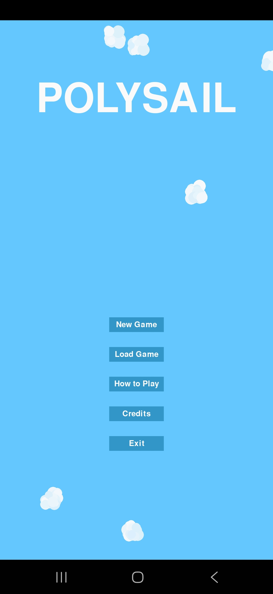
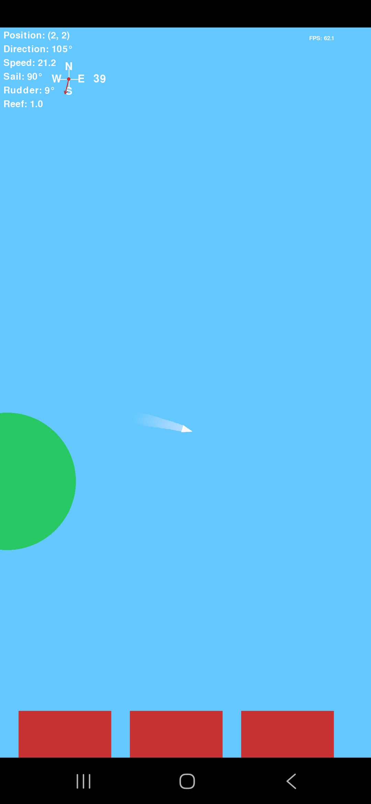

# POLYSAIL
A touch-control sailing game made in pygame. Sail around a vast sea, docking at uncharted islands and avoiding rocks. Trim the sails, man the helm, keep your eyes on the wind and watch your speed to stay safe while sailing. Or just watch the clouds roll lazily by and enjoy the relaxing music.

## Features
- Semi-realistic sailing mechanics
- Simple graphics
- Islands you can dock at
- Wind physics
- Rocks to watch out for
- Aesthetically-pleasing clouds
- Beautiful soundtrack
- Save/Load game

## Controls
- Hold the left side of the sail pad to extend the sails.
- Hold either side of the rudder pad to control the rudder.
- Hold the left side of the reef pad to unreef the sails, hold the right side to reef them again.
- Dock at an island to bring up the menu.

## Requirements
- Python 3
- Pygame

## Installation
- Copy repository
- Run main.py

